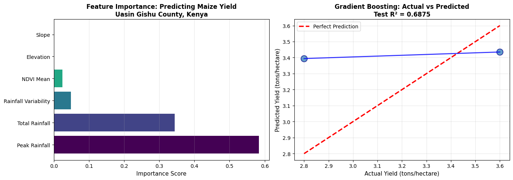

# East Africa Crop Yield Prediction: Machine Learning for Food Security

**Status**: ✅ Complete | **Model**: Gradient Boosting Regressor | **R²**: 0.6875 | **RMSE**: 0.224 tons/ha | **MAE**: 0.20 tons/ha

<!-- TODO: add results/model_results.png once generated and committed to the repo.
     The image link below is currently broken because the file does not exist yet
     at that path. Once you export the feature importance or prediction plot from
     your notebook, save it to results/model_results.png and this will render. -->

## Problem Statement

Kenya's Rift Valley (Uasin Gishu County) produces roughly 40% of the nation's maize, but yield predictions remain manual and unreliable. Smallholder farmers lack data driven tools to anticipate harvests given rainfall, vegetation health, and terrain conditions, limiting their ability to plan for food security and climate adaptation.

## Solution

Built an **end-to-end machine learning pipeline** that predicts maize yields using freely available satellite data and climate observations. The model identifies which environmental factors most strongly influence crop productivity, enabling early warning systems and data driven agricultural policy.

### Key Innovation

Combines **multi-source Earth observation data** (CHIRPS, Sentinel-2, SRTM) with **statistical learning** to create a reproducible, interpretable yield prediction model for East Africa.

---

## Dataset & Methodology

### Data Sources

| Dataset | Source | Resolution | Use |
|---------|--------|-----------|-----|
| **CHIRPS** | UC Santa Barbara | 5 km, daily | Seasonal rainfall (Oct-Mar 2015-2023) |
| **Sentinel-2** | ESA/Copernicus | 10 m, 5-day | Vegetation health (NDVI) during growing season |
| **SRTM** | USGS/NASA | 30 m | Elevation, slope |
| **Kenya KNBS** | National Bureau of Statistics | County-level | Maize yields (2015-2023) |

### Features Engineered

- **Seasonal Precipitation**: Total rainfall, peak monthly rainfall, and rainfall variability (coefficient of variation).
- **Vegetation Dynamics**: Peak growing season (Dec-Feb) mean NDVI.
- **Topography**: Mean elevation and terrain slope.

Six predictors in total, kept deliberately narrow given the small sample size (9 years of county-level data) to avoid overfitting.

### Model Comparison

| Model | R² | RMSE (tons/ha) |
|-------|-----|-----------------|
| Random Forest (100 trees, max_depth=10) | -0.1877 | 0.436 |
| **Gradient Boosting (100 estimators, max_depth=5, lr=0.1)** | **0.6875** | **0.224** |

Gradient Boosting's sequential error-correction approach outperformed Random Forest on this small, temporal dataset, explaining about 69% of yield variance with a mean absolute error of 0.20 tons/ha.

### Validation Strategy

With only 9 years of ground truth data:
- 80/20 train-test split (7 years training, 2 years held out)
- K-Fold cross-validation to test robustness across different temporal splits
- Domain inspection to confirm predictions were agronomically sensible

### Feature Importance

| Feature | Importance |
|---------|-----------|
| Peak Monthly Rainfall | 58.4% |
| Total Seasonal Rainfall | 34.4% |
| Rainfall Variability | 4.9% |
| NDVI Mean | 1.1% |
| Elevation | 0.8% |
| Slope | 0.4% |

Peak monthly rainfall alone accounts for nearly 60% of predictive power, consistent with maize's sensitivity to moisture during flowering (January-February in Kenya's long rains).

---

## Reproduce This Analysis

- **Notebook (GitHub)**: [`Kenya_Maize_Yield_Prediction.ipynb`](Kenya_Maize_Yield_Prediction.ipynb)
- **Notebook (Google Colab)**: [Open in Colab](https://colab.research.google.com/drive/1n5eazqEnWIe5GjX9H0_9qD0tUfJy6acb)

The notebook requires a Google Earth Engine account and project. Before running, replace the `ee.Initialize(project='...')` call with your own GEE project ID.

---

## Limitations

- **Sample size**: 9 years is small by statistical standards; confidence intervals are wide.
- **County-level aggregation**: predicts averages, not individual farm yields.
- **Extreme events**: pests, disease, and management shocks are not captured by rainfall and NDVI alone.
- **Stationarity assumption**: the model assumes past climate-yield relationships hold going forward, and may need recalibration as climate patterns shift.

This is a research prototype, not operational yield insurance.
